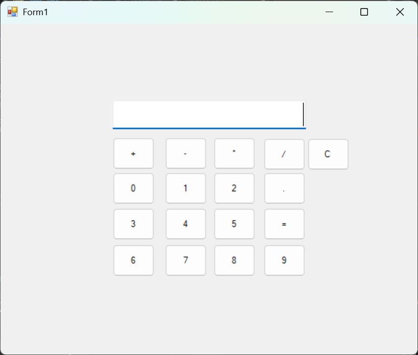

# Calculator App (VB.NET Windows Forms)

A simple yet functional calculator application built with VB.NET and Windows Forms.




## Features
- **Basic Operations**: Addition (+), Subtraction (-), Multiplication (×), Division (÷)
- **Clear Function**: Reset current calculation (C)
- **Error Handling**: Division by zero protection
- **Decimal Support**: Floating-point calculations
- **Extended Functions**:
  - Backspace (⌫)
  - Sign Toggle (±)
  - Square Root (√)
  - Percentage (%)
  - Memory Functions (M+, M-, MR, MC)
- **Keyboard Support**: Number pad and operator keybindings
- **History Display**: Shows current equation

## Installation
1. **Prerequisites**:
   - Visual Studio 2019 or newer
   - .NET Framework 4.7.2 or higher

2. **Run from Source**:
   ```bash
   git clone https://github.com/u89447758/Calculator-App-Windows-Form-VB.NET.git
   cd Calculator-App-Windows-Form-VB.NET
   Open CalculatorApp.sln in Visual Studio
   Build -> Build Solution (Ctrl+Shift+B)
   Press F5 to run
